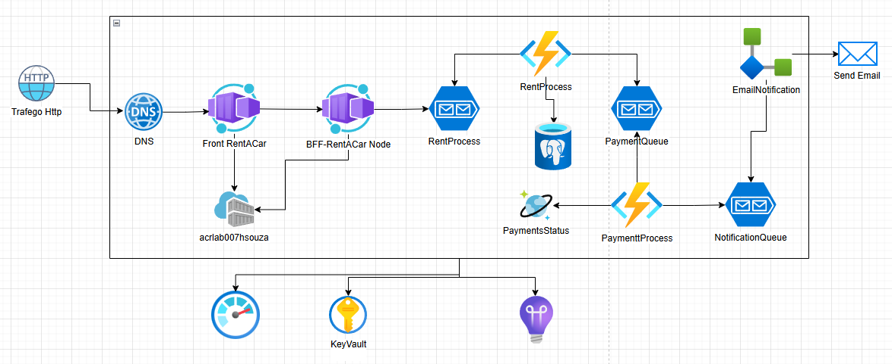

# Aluguel de Carros - Sistema de Locação

Este projeto é um sistema de locação de veículos que utiliza Azure Service Bus para processamento de mensagens e Azure Functions para processamento assíncrono de locações e pagamentos.



## Funcionalidades

- **API de Locação**: Endpoint para solicitação de locação de veículos
- **Processamento Assíncrono**: Utiliza Azure Service Bus para gerenciar filas de processamento
- **Processamento de Locações**: Azure Function para processar solicitações de locação
- **Processamento de Pagamentos**: Azure Function para gerenciar pagamentos
- **Integração com Azure**: Suporte completo a serviços Azure (Service Bus, Key Vault, Functions)

## Estrutura do Projeto

```
Aluguel-Carros/
├── app-locadora-api/
│   ├── index.js              # API principal da locadora
│   ├── package.json          # Dependências do Node.js
│   ├── Dockerfile           # Container da API
│   ├── .env.example         # Exemplo de variáveis de ambiente
│   └── .gitignore          # Arquivos ignorados pelo Git
└── functions/
    └── fnRentProcess/
        ├── fnRentProcess/      # Function para processamento de locações
        │   ├── Function1.cs    # Lógica principal da function
        │   └── Program.cs      # Configuração da function
        ├── fnPaymanet/         # Function para processamento de pagamentos
        │   ├── Function1.cs    # Lógica de pagamento
        │   ├── PaymanetModel.cs # Modelo de dados de pagamento
        │   └── Program.cs      # Configuração da function
        └── fnSBRentProcess/    # Function com Service Bus trigger
            ├── Model/
            │   └── Rent.cs     # Modelo de dados de locação
            └── Program.cs      # Configuração da function
```

## Tecnologias Utilizadas

### Backend API
- **Node.js** - Runtime JavaScript
- **Express.js** - Framework web
- **Azure Service Bus SDK** - Integração com filas do Azure
- **Azure Key Vault SDK** - Gerenciamento de secrets
- **CORS** - Configuração de políticas de origem cruzada

### Azure Functions
- **.NET 6** - Runtime das functions
- **Azure Functions Worker** - Modelo de hospedagem
- **Azure Service Bus Triggers** - Triggers para processamento de filas

### Infraestrutura
- **Docker** - Containerização da API
- **Azure Service Bus** - Gerenciamento de filas
- **Azure Key Vault** - Armazenamento seguro de configurações

## Como Executar

### Pré-requisitos

- Node.js 18+
- .NET 6.0 SDK
- Azure Functions Core Tools
- Docker (opcional)
- Conta Azure com Service Bus configurado

### 1. Configuração da API

1. **Instale as dependências:**
   ```bash
   cd app-locadora-api
   npm install
   ```

2. **Configure as variáveis de ambiente:**
   ```bash
   cp .env.example .env
   ```
   
   Edite o arquivo `.env` com suas configurações:
   ```env
   SERVICE_BUS_CONNECTION_STRING=<sua_connection_string_do_service_bus>
   ```

3. **Execute a API:**
   ```bash
   npm start
   # ou
   node index.js
   ```

   A API estará disponível em `http://localhost:3001`

### 2. Configuração das Azure Functions

1. **Function de Processamento de Locação:**
   ```bash
   cd functions/fnRentProcess/fnRentProcess
   func start
   ```

2. **Function de Processamento de Pagamento:**
   ```bash
   cd functions/fnRentProcess/fnPaymanet
   func start
   ```

3. **Function com Service Bus Trigger:**
   ```bash
   cd functions/fnRentProcess/fnSBRentProcess
   func start
   ```

### 3. Execução com Docker

1. **Build da imagem:**
   ```bash
   cd app-locadora-api
   docker build -t aluguel-carros-api:latest .
   ```

2. **Execute o container:**
   ```bash
   docker run -d -p 3001:3001 --env-file .env aluguel-carros-api:latest
   ```

## API Endpoints

### POST `/api/locacao`
Solicita uma nova locação de veículo.

**Body:**
```json
{
  "nome": "João Silva",
  "email": "joao@email.com"
}
```

**Response:**
```
Locação enviada para a fila com sucesso
```

**Modelo de Dados Processado:**
```json
{
  "nome": "João Silva",
  "email": "joao@email.com",
  "modelo": "Gol",
  "ano": 2022,
  "tempoAluguel": "1 semana",
  "data": "2024-01-15T10:30:00.000Z"
}
```

## Fluxo de Processamento

1. **Solicitação**: Cliente faz POST para `/api/locacao`
2. **Validação**: API valida dados e cria mensagem completa
3. **Envio para Fila**: Mensagem é enviada para fila `queue-locacoes` no Service Bus
4. **Processamento Assíncrono**: Azure Functions processam a mensagem da fila
5. **Processamento de Pagamento**: Function separada gerencia o pagamento

## Modelos de Dados

### RentModel
```csharp
public class RentModel
{
    public string nome { get; set; }
    public string email { get; set; }
    public string modelo { get; set; }
    public int ano { get; set; }
    public string tempoAluguel { get; set; }
    public DateTime data { get; set; }
}
```

### PaymentModel
```csharp
public class PaymanetModel
{
    public Guid id { get; set; }
    public Guid IdPaymant { get; set; }
    public string nome { get; set; }
    public string email { get; set; }
    public string modelo { get; set; }
    public int ano { get; set; }
    public string tempoAluguel { get; set; }
    public DateTime data { get; set; }
    public string status { get; set; }
    public DateTime? dataAprovacao { get; set; }
}
```

## Configuração do Azure Service Bus

1. **Crie um namespace do Service Bus no Azure**
2. **Crie uma fila chamada `queue-locacoes`**
3. **Obtenha a connection string do Service Bus**
4. **Configure a variável de ambiente `SERVICE_BUS_CONNECTION_STRING`**

## Variáveis de Ambiente

```env
# Service Bus
SERVICE_BUS_CONNECTION_STRING=Endpoint=sb://...

# Key Vault (opcional)
AZURE_KEY_VAULT_URL=https://seu-keyvault.vault.azure.net/
```

## Observações

- A API utiliza um modelo fixo de veículo (Gol 2022) para demonstração
- O tempo de aluguel é fixo em "1 semana"
- As Azure Functions processam mensagens de forma assíncrona
- O projeto é configurado para ambiente de desenvolvimento e demonstração
- Certifique-se de que as filas do Service Bus estejam criadas antes de executar

## Licença

Este projeto é desenvolvido para fins educacionais como parte do bootcamp Microsoft Azure Cloud Native.