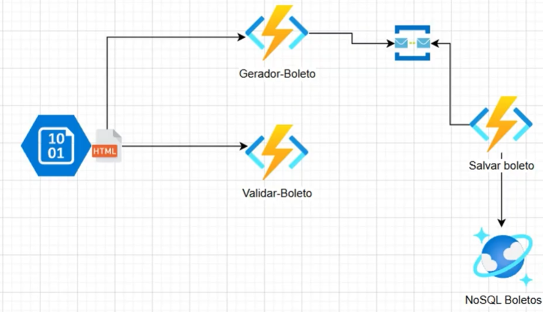

# Autenticador de Boletos

Este projeto é uma aplicação web para geração e validação de códigos de barras de boletos bancários. Utiliza Azure Functions para backend e uma interface simples em HTML, CSS e JavaScript para o frontend.



## Funcionalidades

- **Geração de Código de Barras**: Cria códigos de barras baseados em data de vencimento e valor
- **Validação de Boletos**: Verifica se um código de barras é válido
- **Interface Web Responsiva**: Frontend intuitivo para interação com as funcionalidades
- **Integração com Azure Service Bus**: Envio de mensagens para filas do Azure
- **Visualização do Código de Barras**: Exibe o código em formato de imagem e texto

## Estrutura do Projeto

```
Autenticador-Boletos/
├── fnGeradorBoletos/
│   ├── fnGeradorBoletos/         # Azure Function para geração de código de barras
│   │   └── Function1.cs          # Lógica de geração de boletos
│   └── fnValidaBoleto/           # Azure Function para validação de código de barras
│       └── Function1.cs          # Lógica de validação de boletos
└── Front/
    ├── index.html                # Interface web principal
    ├── script.js                 # Lógica JavaScript do frontend
    └── styles.css                # Estilos CSS (arquivo referenciado)
```

## Como Executar

### Pré-requisitos

- .NET 6.0 ou superior
- Azure Functions Core Tools
- Conta Azure (para Service Bus)
- Visual Studio Code ou Visual Studio

### 1. Configuração do Backend (Azure Functions)

1. **Configure as variáveis de ambiente:**
   ```bash
   ServiceBusConnectionString=<sua_connection_string_do_service_bus>
   ```

2. **Execute as Azure Functions localmente:**
   ```bash
   # Para fnGeradorBoletos (porta 7999)
   cd fnGeradorBoletos/fnGeradorBoletos
   func start --port 7999
   
   # Para fnValidaBoleto (porta 7031)
   cd fnGeradorBoletos/fnValidaBoleto
   func start --port 7031
   ```

### 2. Frontend

1. Abra o arquivo `Front/index.html` em seu navegador
2. Certifique-se de que as Azure Functions estejam rodando nos endpoints:
   - **Geração**: `http://localhost:7999/api/barcode-generate`
   - **Validação**: `http://localhost:7031/api/barcode-validate`

## Como Usar

1. **Gerar Código de Barras:**
   - Informe a data de vencimento (campo preenchido automaticamente com a data atual)
   - Digite o valor do boleto em reais
   - Clique em "Gerar Código de Barras"
   - O código será exibido como imagem e texto

2. **Validar Código:**
   - Após gerar um código, clique em "Validar Código"
   - O sistema verificará se o código é válido
   - A interface mostrará o resultado da validação

## API Endpoints

### POST `/api/barcode-generate`
Gera um código de barras para boleto.

**Body:**
```json
{
  "dataVencimento": "2025-12-31",
  "valor": 150.75
}
```

**Response:**
```json
{
  "barcode": "00820251231000015075000000000000000000000000",
  "valorOriginal": 150.75,
  "DataVencimento": "2025-06-25T...",
  "ImagemBase64": "iVBORw0KGgoAAAANSUhEUgAA..."
}
```

### POST `/api/barcode-validate`
Valida um código de barras existente.

**Body:**
```json
{
  "barcode": "00820251231000015075000000000000000000000000"
}
```

**Response:**
```json
{
  "valido": true,
  "mensagem": "Boleto válido",
  "vencimento": "31-12-2025"
}
```

## Tecnologias Utilizadas

### Backend
- **Azure Functions** (.NET 6)
- **BarcodeStandard** - Geração de códigos de barras
- **SkiaSharp** - Processamento de imagens
- **Azure Service Bus** - Mensageria
- **Newtonsoft.Json** - Serialização JSON

### Frontend
- **HTML5**
- **CSS3**
- **JavaScript (ES6+)**
- **Fetch API** - Requisições HTTP

## Formato do Código de Barras

O código de barras segue o padrão:
- **Posições 1-3**: Código do banco (008)
- **Posições 4-11**: Data de vencimento (YYYYMMDD)
- **Posições 12-19**: Valor em centavos (8 dígitos)
- **Posições 20-44**: Preenchimento com zeros

**Exemplo**: `00820251231000015075000000000000000000000000`

## Configuração do Azure Service Bus

1. Crie um namespace do Service Bus no Azure
2. Crie uma fila chamada `gerador-codigo-barras`
3. Obtenha a connection string
4. Configure a variável de ambiente `ServiceBusConnectionString`

## Observações

- Este projeto é para fins **educacionais** e demonstra integração entre frontend e Azure Functions
- Certifique-se de que as portas 7999 e 7031 estejam disponíveis ao executar localmente
- O valor é convertido para centavos e multiplicado por 10 na geração do código
- A validação verifica apenas o formato e a data, não efetua validações bancárias reais

## Licença

Este projeto é desenvolvido para fins educacionais como parte do bootcamp Microsoft Azure Cloud