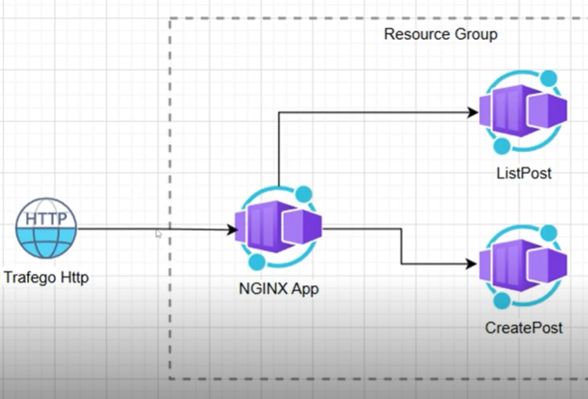

# Blog Container Apps

Este repositório contém um projeto de blog simples hospedado em um container Docker, pronto para ser publicado no Azure Container Apps. O blog permite criar posts e visualizar detalhes.



## Funcionalidades

- Criar, listar e visualizar posts
- Interface responsiva com Bootstrap
- Deploy automatizado via Docker e Azure CLI

## Estrutura do Projeto

```
Blog-Container-Apps/
├── Blog/
│   └── html/
│       ├── create-post.html
│       ├── index.html
│       └── post-detail.html
├── dockerfile
└── images/
    └── blog-container-apps.png
```

## Como Executar Localmente

1. **Clone o repositório:**
   ```sh
   git clone https://github.com/seu-usuario/seu-repositorio.git
   cd dio-formacoes/bootcamp-microsoft-azure-cloud-native/Blog-Container-Apps
   ```

2. **Build da imagem Docker:**
   ```sh
   docker build -t blog-henrique-app:latest .
   ```

3. **Execute o container:**
   ```sh
   docker run -d -p 80:80 blog-henrique-app:latest
   ```

4. **Acesse o blog:**  
   Abra [http://localhost](http://localhost) no navegador.

## Licença

Este projeto é apenas para fins educacionais.